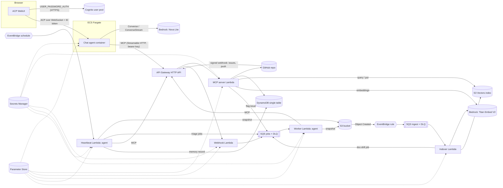

# Architecture and design decisions

## 1. The problem

Strobe's engineering team has a backlog of GitHub issues nobody triages, and docs that no longer match the code. The custodian must:

- triage new issues and comment on them,
- investigate issues a maintainer flags,
- fix documentation that has clearly drifted from the code,
- answer maintainers' questions about the repository in a chat, grounded in the repo itself,
- do some of this on a schedule with nobody prompting it.

## 2. Overview

## 3. The four flows

**Chat (synchronous, streamed).** The browser signs in to Cognito directly over HTTPS, then opens a WebSocket to the ECS container with the ID token. The container verifies the token (signature, issuer, audience, expiry) before accepting the upgrade. Each prompt runs the agent loop: Bedrock ConverseStream with the MCP tool list; when the model requests a tool, the container calls the MCP server and feeds the result back. Text, tool activity and images stream to the browser as ACP session updates.

**Issue triage (asynchronous, event-driven).** GitHub sends a signed `issues.opened` webhook. The webhook Lambda only verifies the HMAC and puts a `triage` job on SQS, then returns 202. The worker Lambda picks the job up, runs the agent with a triage-only tool allow-list (`get_issue`, `search_repo_context`, `read_file`, `record_triage`, `comment_on_issue`), and the comment appears on GitHub a few seconds later. The same path handles `investigate` jobs, created either by the `needs-investigation` label or by the chat agent's `flag_issue_for_investigation` tool.

**Indexing (asynchronous, S3 triggered).** When the default branch moves (push webhook or heartbeat), a `snapshots/<sha>.json` object is written to S3. S3 emits an Object Created event to EventBridge; a rule filtered on the `snapshots/` prefix sends it to the ingest queue; the indexer Lambda chunks the files, embeds each chunk with Titan, writes the vectors to S3 Vectors, deletes vectors for files that no longer exist, and queues a `doc-drift` job for that commit.

**Heartbeat (autonomous).** An EventBridge schedule invokes the heartbeat Lambda. It snapshots the repo if it changed, queues triage for untriaged open issues, reads its previous memory record, asks the agent for a digest of what changed since then, and writes a new `AgentRun` record (DynamoDB) plus the digest (S3 `reports/`). Because every run starts from the previous summary, the agent builds on earlier runs instead of starting cold.

## 4. Component decisions and alternatives

| Decision | Why | Alternative considered |
|---|---|---|
| **MCP server on Lambda + API Gateway, stateless Streamable HTTP with JSON responses** | Each request is independent, so Lambda scales it horizontally and costs nothing when idle. Three different agents (chat, worker, heartbeat) share one tool gateway, which is the point of MCP being a separate component. | MCP on ECS: always-on cost, and scaling needs a load balancer. |
| **Chat agent on ECS Fargate** | A chat turn can take 10 to 30 s and streams many messages over one long-lived WebSocket. That suits a container. It also serves the web UI from the same origin, so no CORS and no separate static host. | Lambda + API Gateway WebSocket API: would require reimplementing ACP by hand and persisting session state per message. |
| **Webhook only enqueues** | GitHub expects a reply within 10 s; a model call can exceed that. SQS absorbs bursts (for example 20 issues imported at once), retries failures, and after 3 failures parks the message in a DLQ for inspection. | Calling Bedrock inside the webhook: timeouts, lost events, no retry. |
| **S3 -> EventBridge -> SQS -> Lambda for indexing** | Writing the snapshot is the trigger, so any producer (push webhook, heartbeat, chat "re-index" tool) gets indexing for free. EventBridge filters by prefix; SQS adds buffering and a DLQ. | Direct S3 -> Lambda notification: no buffering, retries are harder to observe. |
| **S3 Vectors for retrieval** | Serverless, pay per use, no cluster to run. Chunk text is stored as non-filterable metadata so a query returns the text directly; `kind` is filterable so the agent can search only docs, code or issues. | OpenSearch Serverless: minimum capacity cost even when idle. |
| **Single DynamoDB table** | All access patterns are "get one item" or "query one partition by sort-key prefix" (issues, jobs, runs newest first), so one table covers eight entity types with no scans and no GSIs. It also avoids the shared account's table quota that blocked Assessment 1. | One table per entity: more resources, same queries. |
| **Tool allow-lists per task** | The worker doing triage cannot open pull requests; the heartbeat cannot post comments. Limits the blast radius of a confused model. | Give every agent every tool. |
| **Narrow write tools** | `propose_doc_update` only accepts documentation paths and always opens a PR, never pushes. `record_triage` cannot apply the `needs-investigation` label (that would loop). | Generic "write file" tool. |
| **Nova Lite** | Low cost, available in-region in Sydney, supports tool use and image input (screenshots of bugs). | A larger model: better answers, but the assessment is about infrastructure. |
| **Secrets Manager + Parameter Store** | Secrets (GitHub token, webhook secret, MCP key) are in one secret; non-secret settings (model ids, names, URLs) are one JSON parameter. Services only get the *names* in env vars. Changing the model is a parameter update, no redeploy. | Env vars: plaintext in the console, redeploy for every change. |

## 5. Data model (DynamoDB, PK/SK)

| Entity | PK | SK | Purpose |
|---|---|---|---|
| Repository | `REPO#owner/name` | `META` | last snapshot/indexed commit, last heartbeat |
| Snapshot | `REPO#...` | `SNAPSHOT#<sha>` | S3 key, file and chunk counts, indexing status |
| Chunk | `REPO#...` | `CHUNK#<vectorKey>` | reference from a vector back to its file/issue |
| Issue triage | `REPO#...` | `ISSUE#000123` | category, priority, summary, related files, comment URL |
| Job | `REPO#...` | `JOB#<uuid>` | async job status: queued, processing, done, failed |
| Doc check | `REPO#...` | `DOCCHECK#<time>` | drift findings and PR URL |
| Agent run (memory) | `REPO#...` | `RUN#<time>` | what each heartbeat did and its summary |
| Chat session | `USER#<cognito sub>` | `CHAT#<id>` | who chatted, when, how many turns |

## 6. Security

- The chat accepts a WebSocket only with a valid Cognito ID token; sign-up is limited to QUT emails by the pre sign-up trigger.
- The password goes from the browser straight to Cognito over HTTPS; our server never sees it.
- The MCP endpoint requires a bearer key from Secrets Manager (constant-time comparison); API Gateway throttles it.
- Webhooks are verified with HMAC-SHA256 against the secret GitHub signs with.
- The GitHub token is fine-grained and limited to one repository.
- The bucket blocks public access and is encrypted; the ingest queue policy only accepts messages from the one EventBridge rule.

**Known trade-off:** the chat page itself is served over plain HTTP from the task's public IP. HTTPS would need a load balancer with an ACM certificate, and Elastic Load Balancing is not in the course's permitted service list. The ID token (valid 60 minutes) is the only credential that crosses that connection.

## 7. Scalability, reliability and cost

- Lambda components scale per request or per message; SQS event source mappings cap worker concurrency at 5 so a burst of issues cannot exhaust Bedrock quota or GitHub rate limits.
- Visibility timeouts are longer than the Lambda timeouts, so a message is never processed twice concurrently; handlers are idempotent (an issue already triaged is skipped).
- Partial batch failure reporting retries only failed messages; DLQs keep poison messages.
- The ECS service could scale out (sessions are per connection), but it runs one small task (0.25 vCPU, 512 MB) to keep cost down; `99-pause.ps1` scales it to zero between sessions.
- Idle cost is close to zero apart from the Fargate task: Lambda, SQS, EventBridge, S3 Vectors and on-demand DynamoDB are all pay per use. S3 lifecycle rules expire snapshots and chat uploads after 30 days.

## 8. Demo checklist (about 6 minutes)

1. **Chat, retrieval-grounded:** ask "How do I run this project and which port does it use?" Point at the `Searching vector store: ...` line and the `Sources:` line. Then ask "Does the README match the code?"; the code says port 8080 and `npm start` while the README says 3000 and `npm run serve`, which is exactly the drift the custodian is meant to catch.
2. **Image out:** "Show me an overview of the backlog" returns a chart image.
3. **Image in:** attach a screenshot of an error and ask the agent to describe it or open an issue.
4. **Async workflow:** open a new issue on GitHub, then refresh it: a triage comment and `type:`/`priority:` labels appear within seconds. Show the worker log (`aws logs tail /aws/lambda/n12228591-a2-worker`) and the Job record moving from queued to done.
5. **Autonomous run:** show a `RUN#` item in DynamoDB (or a `reports/` digest in S3) with a timestamp before the demo, plus any doc-drift pull request opened by the custodian.
6. **Separate MCP server:** show the MCP Lambda and API Gateway route in the console, or connect MCP Inspector (`npx @modelcontextprotocol/inspector`, Streamable HTTP, header `Authorization: Bearer <key>`) and list the 16 tools.
